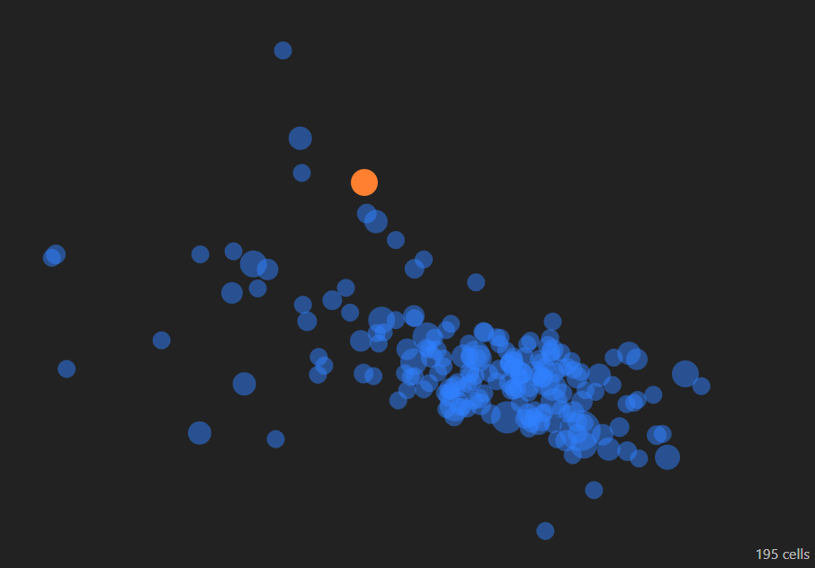
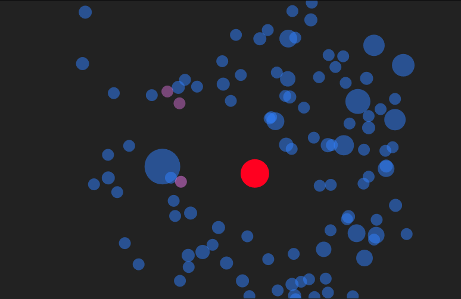
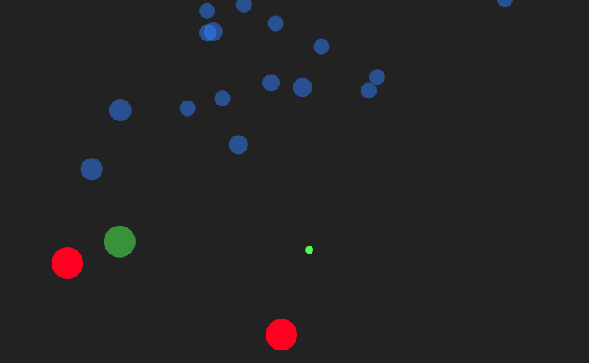

# Cell Simulation

Demo: https://cell-simulation.netlify.app/

This is a simulation of cells who are looking for food. They are attracted to this food and move smoothly towards it using a steering and a swimming motion, almost like fish. The parameters of this motion are randomized.

Once the food is eaten by a cell, the cell grows and becomes slower, a new cell is born at that point, and new food appears elsewhere.

You can also turn on poison, which pops up regularly. The cells try avoid the poison, some better than others. If a cell gets poisoned, it changes its color and dies quickly, whereas the poison gets bigger. By some chance a dead cell produces new food, which is then the basis for creating new food once eaten.

The cells have another defense mechanism. Sometimes after having food they produce helper cells which immediately head off to neutralize the nearest poison.

There can be at most 1000 cells and 4 foods at a time.
