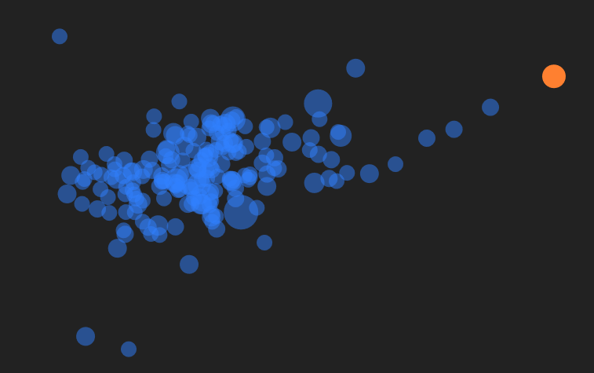

# Cell Simulation

Demo: https://cell-simulation.netlify.app/

This is a simulation of cells who are looking for food. They are attracted to this food and move smoothly towards it using a steering and a swimming motion, almost like fish. The parameters of this motion are randomized.

Once the food is eaten by a cell, the cell grows and becomes slower, a new cell is born at that point, and new food appears elsewhere.

This is just the first phase of the simulation. As the number of cells grows, other phases start, in which various types of cells are introduced, some of which are friends and some of which are opponents.

You can use the menu to check out the numbers of each type of cell and to see their development over time.
