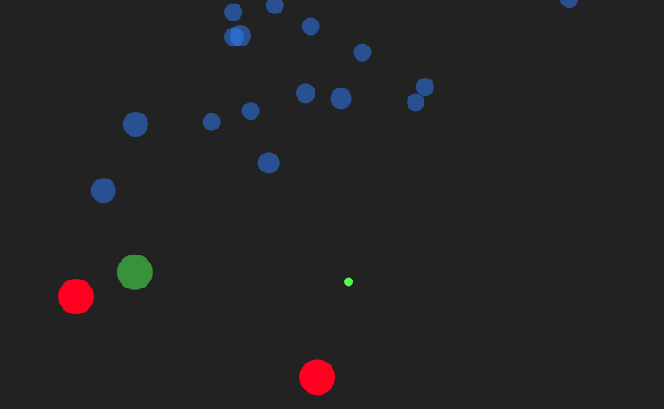

# Cell Simulation

Demo: https://cell-simulation.netlify.app/

This is a simulation of cells who are looking for food. They are attracted to this food and move smoothly towards it using a steering and a swimming motion, almost like fish. The parameters of this motion are randomized.

Once the food is eaten by a cell, the cell grows and becomes slower, a new cell is born at that point, and new food appears elsewhere.

This simulation is already fun to watch and quite relaxing. This changes quickly when you turn on the poison cells in the menu. They pop up regularly. The cells try avoid the poison, some more than others via randomized parameters. If a cell gets poisoned, it changes its color and dies quickly, whereas the poison gets bigger. The initial size of the poison cells depends on the cell population.

By some chance a dead cell produces new food, which is then the basis for creating new food once eaten. By some very low chance the cells reproduce immortable white cells which cannot be poisoned at all.

The cells have another defense mechanism. Sometimes they reproduce helper cells which immediately head off to neutralize the nearest poison, which is then no harm anymore.

There can be at most 1000 cells and 4 foods at a time. Above 900 cells you will find that _huge_ poison cells may appear, which leads to a natural balance.

At every time you can check out the statistics and pause the simulation in the menu.
